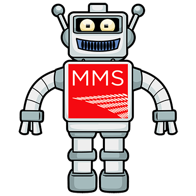

# MMSMOA Twitter Bot

___IMPORTANT NOTE:___ The MMSMOA Retweet Bot was officially shut down in late June, 2023 due to Twitter's API changes. As a result this repository has been archived and under no further development.

The [MMSMOA Retweet Bot](https://twitter.com/mmsmoabot) was developed as a novelty bot/project by [@zaskem](https://github.com/zaskem)/[@matt_zaske](https://twitter.com/matt_zaske) to like/retweet original content, randomly selected from recent activity, during the [MMSMOA conference](https://mmsmoa.com/).

The bot process searches for original (e.g. no retweets, quote tweets, or replies) content and, on a self-metered schedule, likes and retweets a randomly-selected match. Not all matching content will be liked/retweeted (not a live-stream bot); the intent is to select one in every 3-4 matches during periods of conference activity.

Bot code is written in PHP and uses [Twitter's v2 API](https://developer.twitter.com/en/docs/twitter-api) for its functionality. Beyond a Twitter Developer account and method (such as [Twurl](https://developer.twitter.com/en/docs/tutorials/using-twurl)) by which to create [3-Legged OAuth tokens](https://developer.twitter.com/en/docs/authentication/oauth-1-0a/obtaining-user-access-tokens) (assuming a "bot" Twitter account is used), there are no libraries or dependencies to install for bot use.

The bot is designed to self-meter its like/retweet cadence so as not to be "spammy" or overactive. It will like/retweet no more than once every five minutes at peak capacity. Realistically, the bot self-adjusts its cadence to the average interval in which _about three tweets_ have been posted (over the search period of the previous 1-2 hours during conference time).

## Acknowledgements
The [MMSMOA Retweet Bot](https://twitter.com/mmsmoabot) is not officially associated with [MMSMOA](https://mmsmoa.com/). The bot's [profile image](https://twitter.com/mmsmoabot/photo) is a mashup of [Jamie Sale's free clip art](https://www.jamiesale-cartoonist.com/free-cartoon-robot-vector/) and the MMS logo. The bot's header image was semi-randomly selected from previous MMSMOA photo slideshows.

During MMSMOA 2023 (at MOA), find [@matt_zaske](https://twitter.com/matt_zaske) to get a limited-edition MMSMOA Retweet Bot sticker while they last (or just to chat)!

The [GitHub repo](https://github.com/zaskem/twitterbot-mmsbot) contains the basics for getting started with such a bot.

## The MMSMOA Retweet Bot's Future
### Updated April 3, 2023
With Twitter's recent (and terrible) decisions regarding the future of their API, specifically in charging an unrealistic rate for projects like this, it is unclear what future the bot faces. The bot will stay in operation as long as the existing API access does. At the time of this update, Twitter indicates all previous API access will be deprecated by the end of April 2023. With no tweet search capability identified for "free" API access tiers in the New World Order, the bot's automatic functionality will cease once tweet searches via the API are removed...and unfortunately just before MMS 2023 at MOA.

It's been a grand and fun ride indirectly promoting MMS and the content/excitement around it, but Twitter's insistence on burning novelty access to the ground is the death knell for things like this.

### Final update July, 2023
In late June, 2023, Twitter's new API access silently took effect, rendering the bot inactive by virtue of not allowing for Tweet searches. On June 28, 2023, the bot services were officially shut down and archived on the managing server. This repository has been archived and under no further development.

I have no intention of deleting the Twitter bot account itself, so past activity of the [MMSMOA Retweet Bot](https://twitter.com/mmsmoabot) will live on as long as Twitter does (unless/until the account is deleted by Twitter).